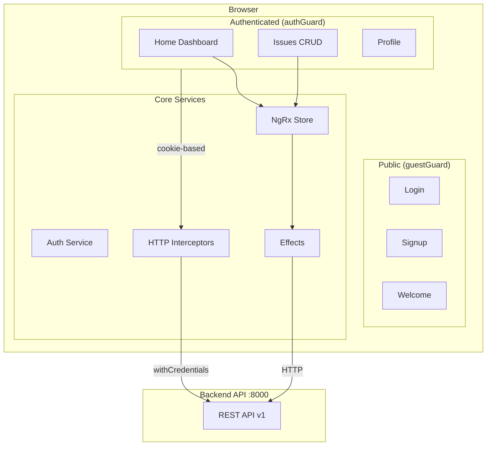

# TasKanLine Client

**Управляй задачами в Kanban-стиле — быстро, адаптивно, с заботой о безопасности.**

Фронтенд-приложение для TasKanLine — системы управления задачами с Kanban-доской. Построено на Angular 21 с сигналами, NgRx, TailwindCSS и cookie-based аутентификацией. Поддержка тем, адаптивный дизайн, кросс-табовая синхронизация.

## Возможности

- **Issues-менеджмент** — создание, просмотр, редактирование задач
- **Аутентификация** — регистрация, вход, cookie-based сессии с cross-tab синхронизацией
- **Темы** — светлая/тёмная с автоопределением системных настроек
- **Адаптивность** — мобильный sidebar с автосворачиванием, клавиатурная навигация
- **Обработка ошибок** — глобальные interceptors, информативные страницы 403/404/500
- **Toast-уведомления** — success, error, info, warning с автоскрытием

## Quick Start

### Требования

- Node.js >= 22.20
- Bun (рекомендуется) или npm 11.6+

### Установка

```bash
git clone <repository-url>
cd TasKanLine/client
bun install
bun run s
```

Откройте [http://localhost:4200](http://localhost:4200) в браузере.

> [!NOTE]
> Backend API должен быть запущен на `http://localhost:8000`. См. серверную часть проекта.

## Tech Stack

| Слой | Технология | Версия |
|------|-----------|--------|
| Framework | Angular (standalone, signals) | 21.1 |
| State Management | NgRx + Signals | 21.0 |
| Styling | TailwindCSS + SCSS | 4.1 |
| Icons | Lucide Angular | 0.555 |
| Testing | Vitest | 4.0 |
| Package Manager | Bun | latest |
| TypeScript | Strict mode, no `any` | 5.9 |

## Архитектура



## Структура проекта

```
src/app/
├── core/            # Синглтоны: auth (guards, interceptors, store), ThemeService, ToastService
├── features/        # Изолированные route-level компоненты (login, signup, home, issues, profile, errors)
├── shared/          # Переиспользуемые UI: button, toast, theme-switcher
├── layout/          # Shell: header, sidebar, footer, main-layout
├── app.ts           # Root component (<router-outlet> + <app-toast>)
├── app.config.ts    # Providers: router, HttpClient, NgRx, APP_INITIALIZER
└── app.routes.ts    # Top-level route tree
```

Подробнее об архитектуре: [`docs/architecture/`](./docs/architecture/)

## Команды разработки

```bash
bun run s            # Dev server (http://localhost:4200)
bun run build        # Production build
bun run lint         # ESLint check
bun run lint:fix     # ESLint auto-fix
bun run prettier     # Prettier format
bun test             # Все тесты (Vitest)
bunx vitest run <path>  # Один тест-файл
```

## Docker

### Сборка и запуск

```bash
docker build -t taskanline-client .
docker run -p 80:80 taskanline-client
```

### Docker Compose

```bash
docker-compose up -d
```

Контейнер использует multi-stage build (Bun -> Nginx Alpine), статика отдаётся через Nginx на порту 80.

<details>
<summary>Детали Docker-архитектуры</summary>

- **Stage 1:** `oven/bun:1` — установка зависимостей и production-сборка
- **Stage 2:** `nginx:alpine` — минимальный образ для раздачи статики
- Порт по умолчанию: `8080:80` (docker-compose) или `80:80` (docker run)
- Требуется внешняя сеть `taskanline-client-network`

</details>

## Аутентификация

Приложение использует **cookie-based аутентификацию** (не токены в localStorage):

1. `APP_INITIALIZER` проверяет сессию при загрузке (`GET /auth/me`)
2. `authInterceptor` добавляет `withCredentials: true` ко всем запросам
3. `errorInterceptor` обрабатывает 401/403/5xx с редиректами
4. `BroadcastChannel` синхронизирует auth-состояние между вкладками

> [!IMPORTANT]
> Auth-токены **никогда** не хранятся в localStorage. Вся аутентификация через HttpOnly cookies.

## Горячие клавиши

| Клавиша | Действие |
|---------|----------|
| `[` | Открыть/закрыть sidebar |
| `Escape` | Закрыть выпадающие меню |
| `Tab` | Навигация по sidebar-элементам |

## Contributing

1. Следовать [архитектурным правилам](./docs/architecture/arch-rules.md)
2. Conventional commits со скоупом: `feat(home): ...`, `fix(auth): ...`
3. Тесты для новой функциональности
4. Перед PR: `bun run lint && bun test`

## Документация

| Раздел | Путь |
|--------|------|
| Архитектура | [`docs/architecture/`](./docs/architecture/) |
| Гайды разработки | [`docs/guides/`](./docs/guides/) |
| Продуктовые решения | [`docs/product/`](./docs/product/) |
| AI-контекст | [`docs/ai-context/`](./docs/ai-context/) |
