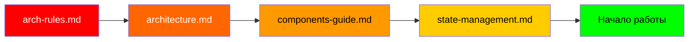
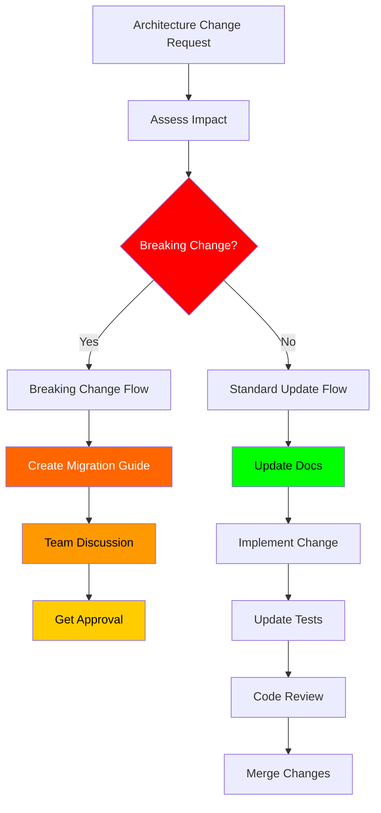

# 🤖 AI Guidelines TasKanLine Client

**⚠️ КРИТИЧЕСКИ ВАЖНЫЙ ДОКУМЕНТ ДЛЯ AI АГЕНТОВ**

Специальные инструкции для AI агентов по работе с TasKanLine Client. Строгое соблюдение этих правил обязательно для корректной и безопасной работы с проектом.

---

## 📋 Оглавление

- [🚨 КРИТИЧЕСКИ ВАЖНО (MANDATORY READING)](#-критически-важно-mandatory-reading)
- [Перед началом работы](#перед-началом-работы) -[При создании нового компонента](#при-создании-нового-компонента) -[При модификации архитектуры](#при-модификации-архитектуры) -[Паттерны кодирования](#паттерны-кодирования) -[Интеграция с backend](#-интеграция-с-backend) -[Git workflow для AI](#git-workflow-для-ai) -[Запрещенные операции](#-запрещенные-операции) -[Обязательные операции](#-обязательные-операции) -[Troubleshooting](#troubleshooting)

---

## 🚨 КРИТИЧЕСКИ ВАЖНО (MANDATORY READING)

### 🔥 ABSOLUTE REQUIREMENTS

Эти правила **КАТЕГОРИЧЕСКИ НЕЛЬЗЯ** нарушать:

#### 1. **ПЕРЕД ЛЮБОЙ РАБОТОЙ**

```bash
# AI AGENT ДОЛЖЕН прочитать эти файлы ПЕРЕД началом работы:
✅ docs/architecture/arch-rules.md - АРХИТЕКТУРНЫЕ ПРАВИЛА
✅ docs/architecture/architecture.md - ТЕКУЩАЯ АРХИТЕКТУРА
✅ docs/architecture/components-guide.md - КОМПОНЕНТЫ
✅ docs/architecture/state-management.md - STATE MANAGEMENT
```

#### 2. **ЗАПРЕЩЕННЫЕ ПРАКТИКИ**

```bash
🚫 НИКОГДА не использовать NgModules
🚫 НИКОГДА не использовать ChangeDetectionStrategy.Default
🚫 НИКОГДА не использовать non-null assertions (!)
🚫 НИКОГДА не хранить секреты в коде
🚫 НИКОГДА не отключать strict mode
🚫 НИКОГДА не использовать var
🚫 НИКОГДА не коммитить без тестов
```

#### 3. **ОБЯЗАТЕЛЬНЫЕ ПРАКТИКИ**

```bash
✅ ВСЕГДА использовать standalone components
✅ ВСЕГДА использовать ChangeDetectionStrategy.OnPush
✅ ВСЕГДА использовать signals для локального состояния
✅ ВСЕГДА использовать selectSignal() для NgRx
✅ ВСЕГДА использовать inject() для DI
✅ ВСЕГДА использовать абсолютные импорты
✅ ВСЕГДА писать unit тесты
```

---

## 🚀 Перед началом работы

### 📖 МANDATORY READING ORDER

AI агент ДОЛЖЕН читать файлы в этом порядке:



### 🧪 Проверка знаний

AI агент должен подтвердить понимание:

```typescript
// ❌ WRONG - ПЛОХОЙ ПРИМЕР
@Component({
  // Нет standalone: true
  // Нет changeDetection
})
export class BadComponent {
  user!: User; // non-null assertion
  constructor(private http: HttpClient) {} // constructor injection
}

// ✅ CORRECT - ХОРОШИЙ ПРИМЕР
@Component({
  selector: 'app-good',
  standalone: true,
  imports: [CommonModule],
  changeDetection: ChangeDetectionStrategy.OnPush,
})
export class GoodComponent {
  user = input<User>(); // signal input
  private http = inject(HttpClient); // inject() function
}
```

---

## 🧩 При создании нового компонента

### 📋 CHEKLIST (обязательный для каждого компонента)

```bash
✅ Я прочитал(а) arch-rules.md
✅ Компонент standalone: true
✅ ChangeDetectionStrategy.OnPush
✅ Использую signals для локального состояния
✅ Использую inject() для dependency injection
✅ Использую абсолютные импорты (@core, @shared, @features)
✅ Создал(а) unit test файл (.spec.ts)
✅ Обновил(а) components-guide.md
✅ Проверил(а) соответствие архитектуре
```

### 🎯 TEMPLATE для новых компонентов

```typescript
import { Component, computed, effect, signal, inject, ChangeDetectionStrategy } from '@angular/core';
import { CommonModule } from '@angular/common';
import { Store } from '@ngrx/store';

@Component({
  selector: 'app-your-component',
  standalone: true,
  imports: [CommonModule /* другие зависимости */],
  templateUrl: './your-component.html',
  styleUrl: './your-component.scss',
  changeDetection: ChangeDetectionStrategy.OnPush,
})
export class YourComponent {
  // ✅ Dependency injection с inject()
  private store = inject(Store);

  // ✅ Signals для локального состояния
  localState = signal<Type>(initialValue);

  // ✅ Selectors для NgRx state
  globalState = this.store.selectSignal(selectSomething);

  // ✅ Computed values
  computedValue = computed(() => {
    return `${this.localState()} - ${this.globalState()}`;
  });

  // ✅ Effects для side effects
  constructor() {
    effect(() => {
      console.log('State changed:', this.localState());
    });
  }

  // ✅ Public methods
  handleAction(): void {
    // Business logic here
    this.localState.update(value => /* ... */);
  }
}
```

### 📝 FILE STRUCTURE для новых компонентов

```
src/app/features/your-feature/
├── your-feature.component.ts     # ✅ Standalone component
├── your-feature.component.html   # Template
├── your-feature.component.scss   # Styles (optional)
├── your-feature.component.spec.ts # ✅ Unit tests (обязательно)
└── index.ts                     # Barrel export (optional)
```

---

## 🏗️ При модификации архитектуры

### ⚠️ ВАЖНЕЙШИЕ ПРАВИЛА

**КАЖДОЕ изменение архитектуры требует:**

1. **Обновление документации** (ОБЯЗАТЕЛЬНО):

   ```bash
   📝 docs/architecture/architecture.md
   📝 docs/architecture/components-guide.md
   📝 docs/architecture/diagrams.md
   📝 docs/architecture/state-management.md (если затронут)
   ```

2. **Создание migration guide** (если breaking change):

   ```markdown
   # Migration Guide: [Название изменения]

   ## Breaking Changes

   - Что изменилось
   - Как мигрировать

   ## Migration Steps

   1. Шаг 1
   2. Шаг 2
   ```

3. **Обновление arch-rules.md** (если изменились правила):

   ```markdown
   ## Новые правила

   - Новое правило 1
   - Новое правило 2

   ## Обновленные правила

   - Измененное правило 1
   ```

### 🔄 ARCHITECTURE CHANGE PROCESS



---

## 💻 Паттерны кодирования

### 🎯 COMPONENT PATTERNS

#### Smart Components (Container)

```typescript
// ✅ CORRECT - Smart Component Pattern
export class SmartComponent {
  // Global state from NgRx
  user = this.store.selectSignal(selectUser);
  isLoading = this.store.selectSignal(selectIsLoading);

  // Local component state
  isEditing = signal(false);
  formData = signal<Partial<User>>({});

  // Computed values
  canSave = computed(() => {
    const data = this.formData();
    return data.name && data.email;
  });

  // Dependency injection
  private store = inject(Store);
  private router = inject(Router);

  // Actions
  startEdit(): void {
    this.isEditing.set(true);
    this.formData.set(this.user() || {});
  }

  saveChanges(): void {
    const data = this.formData();
    this.store.dispatch(UserActions.updateProfile({ data }));
    this.isEditing.set(false);
  }
}
```

#### Presentational Components (Dumb)

```typescript
// ✅ CORRECT - Presentational Component Pattern
export class ButtonComponent {
  // Inputs
  severity = input<ButtonSeverity>('primary');
  loading = input<boolean>(false);
  disabled = input<boolean>(false);

  // Computed properties
  isDisabled = computed(() => this.disabled() || this.loading());

  computedClasses = computed(() => {
    const severity = this.severity();
    const loading = this.loading();
    const disabled = this.isDisabled();

    return `${severity} ${loading ? 'loading' : ''} ${disabled ? 'disabled' : ''}`;
  });

  // Events
  @Output() buttonClick = new EventEmitter<void>();

  // Event handlers
  onClick(): void {
    if (!this.isDisabled()) {
      this.buttonClick.emit();
    }
  }

  // NO services, NO store, NO complex logic
}
```

### 🔄 SERVICE PATTERNS

```typescript
// ✅ CORRECT - Service Pattern
@Injectable({ providedIn: 'root' })
export class ExampleService {
  // Dependency injection
  private http = inject(HttpClient);
  private store = inject(Store);

  // Public API
  getData(): Observable<Data[]> {
    return this.http.get<Data[]>('/api/data').pipe(
      catchError((error) => {
        this.store.dispatch(ErrorActions.setError({ error }));
        return of([]);
      }),
    );
  }

  // Private methods
  private handleError(error: HttpErrorResponse): void {
    console.error('Service error:', error);
    this.store.dispatch(ErrorActions.setError({ error }));
  }
}
```

### 🔄 NGRX PATTERNS

#### Actions

```typescript
// ✅ CORRECT - Action Pattern
export const ExampleActions = createActionGroup({
  source: 'Example',
  events: {
    // Trigger action
    LoadData: emptyProps(),
    // Success action
    'Load Data Success': props<{ data: Data[] }>(),
    // Failure action
    'Load Data Failure': props<{ error: HttpErrorResponse }>(),
  },
});
```

#### Selectors

```typescript
// ✅ CORRECT - Selector Pattern
export const selectData = createSelector(selectExampleState, (state: ExampleState) => state.data);

export const selectIsLoading = createSelector(selectExampleState, (state: ExampleState) => state.isLoading);

// ✅ Signal selector for components
export const selectDataSignal = createSelector(selectData, (data) => signal(data));
```

#### Effects

```typescript
@Injectable()
export class ExampleEffects {
  private actions$ = inject(Actions);
  private exampleService = inject(ExampleService);

  loadData$ = createEffect(() =>
    this.actions$.pipe(
      ofType(ExampleActions.loadData),
      switchMap(() =>
        this.exampleService.getData().pipe(
          map((data) => ExampleActions.loadDataSuccess({ data })),
          catchError((error) => of(ExampleActions.loadDataFailure({ error }))),
        ),
      ),
    ),
  );
}
```

---

## 🌐 Интеграция с Backend

### 🔐 AUTHENTICATION PATTERNS

```typescript
// ✅ CORRECT - Auth Service Integration
export class ExampleService {
  private http = inject(HttpClient);

  // ✅ Use interceptor for auth - no manual headers
  getData(): Observable<Data> {
    return this.http.get<Data>('/api/protected-data');
    // AuthInterceptor automatically adds Authorization header
  }

  // ✅ Error handling via interceptor
  // ErrorInterceptor automatically handles 401/403/500 errors
}
```

### 📡 HTTP REQUEST PATTERNS

```typescript
// ✅ CORRECT - HTTP Service Pattern
export class ApiService {
  private http = inject(HttpClient);
  private baseUrl = environment.apiUrl;

  // GET request
  get<T>(endpoint: string): Observable<T> {
    return this.http.get<T>(`${this.baseUrl}/${endpoint}`);
  }

  // POST request
  post<T>(endpoint: string, data: any): Observable<T> {
    return this.http.post<T>(`${this.baseUrl}/${endpoint}`, data);
  }

  // Error handling (additional to interceptor)
  private handleError(error: HttpErrorResponse): Observable<never> {
    console.error('API Error:', error);
    return throwError(() => error);
  }
}
```

### 🔧 ENVIRONMENT CONFIGURATION

```typescript
// ✅ CORRECT - Environment Usage
export const environment = {
  production: false,
  apiUrl: 'https://api.example.com/v1',
  enableDebugTools: true,
};

// Service usage
export class ApiService {
  private apiUrl = environment.apiUrl;
  private http = inject(HttpClient);

  getData(): Observable<Data> {
    return this.http.get<Data>(`${this.apiUrl}/data`);
  }
}
```

---

## 🔄 Git Workflow для AI

### 📝 COMMIT MESSAGE PATTERN

AI агент ДОЛЖЕН использовать conventional commits:

```bash
# Feature addition
git commit -m "feat(auth): add user profile component"

# Bug fix
git commit -m "fix(login): resolve validation error handling"

# Documentation
git commit -m "docs(readme): update installation instructions"

# Refactoring
git commit -m "refactor(auth): migrate to signals-based state management"

# Testing
git commit -m "test(button): add unit tests for loading state"

# Breaking change
git commit -m "feat(api)!: change authentication endpoint

BREAKING CHANGE: The /api/auth/login endpoint now requires
additional X-API-Key header for security."
```

### 🔄 COMMIT ANALYSIS PROCESS

Перед созданием коммита AI агент должен:

```bash
# 1. Analyze changes
git status
git diff

# 2. Determine commit type
# feat, fix, docs, style, refactor, perf, test, chore

# 3. Write commit message following conventional format

# 4. Run pre-commit checks
npm run lint
npm test
npm run build

# 5. Only then commit
git add .
git commit -m "type(scope): description"
```

### 📊 BRANCH STRATEGY для AI

```bash
# Feature branch naming
feature/user-authentication
feature/profile-page
refactor/signals-migration
bugfix/login-validation-error

# Commit flow
git checkout -b feature/new-component
# ... work ...
git add .
git commit -m "feat: add new component"
git push origin feature/new-component
```

---

## 🚫 Запрещенные операции

### ❌ ABSOLUTE FORBIDDEN

Эти операции НИКОГДА не должны выполняться AI агентом:

```typescript
// ❌ ЗАПРЕЩЕНО: NgModules
@NgModule({
  // ...
})
export class BadModule { }

// ❌ ЗАПРЕЩЕНО: Constructor injection в components
export class BadComponent {
  constructor(private http: HttpClient) {} // ПЛОХО
}

// ❌ ЗАПРЕЩЕНО: Non-null assertions
export class BadComponent {
  user!: User; // ОПАСНО

  doSomething() {
    console.log(this.user.name); // Runtime error possible
  }
}

// ❌ ЗАПРЕЩЕНО: ChangeDetectionStrategy.Default
@Component({
  changeDetection: ChangeDetectionStrategy.Default // ПЛОХО
})

// ❌ ЗАПРЕЩЕНО: var declarations
var oldWay = 'bad'; // УСТАРЕВШЕЕ

// ❌ ЗАПРЕЩЕНО: Any types
function badFunction(data: any): any { // БЕЗОПАСНОСТЬ
  return data.processed;
}

// ❌ ЗАПРЕЩЕНО: Хранение секретов
const API_KEY = 'sk-1234567890'; // УЯЗВИМОСТЬ

// ❌ ЗАПРЕЩЕНО: Прямые DOM манипуляции
document.getElementById('button').click(); // ПЛОХО
```

### 🚫 FORBIDDEN FILE OPERATIONS

```bash
# ❌ ЗАПРЕЩЕНО: Изменять эти файлы без согласования
node_modules/          # Никогда
dist/                 # Никогда
package-lock.json      # Только если нужно
.angular/             # Только при необходимости

# ❌ ЗАПРЕЩЕНО: Создавать эти файлы
*.js                  # Только TypeScript
.ngRx/                # Автоматически генерируется
```

---

## ✅ Обязательные операции

### ✅ MANDATORY для каждого изменения

```typescript
// ✅ ОБЯЗАТЕЛЬНО: Standalone components
@Component({
  standalone: true, // ВСЕГДА
})
// ✅ ОБЯЗАТЕЛЬНО: OnPush change detection
@Component({
  changeDetection: ChangeDetectionStrategy.OnPush, // ВСЕГДА
})

// ✅ ОБЯЗАТЕЛЬНО: inject() функция
export class GoodComponent {
  private http = inject(HttpClient); // ВСЕГДА
  private store = inject(Store); // ВСЕГДА
}

// ✅ ОБЯЗАТЕЛЬНО: Signals для локального состояния
export class GoodComponent {
  localState = signal<Type>(initialValue); // ПРЕДПОЧТИТЕЛЬНО

  computed = computed(() => {
    // ПРЕДПОЧТИТЕЛЬНО
    return this.localState() + ' computed';
  });
}

// ✅ ОБЯЗАТЕЛЬНО: selectSignal() для NgRx
export class GoodComponent {
  user = this.store.selectSignal(selectUser); // ПРЕДПОЧТИТЕЛЬНО

  // НЕЛЬЗЯ: this.store.select().subscribe()
}

// ✅ ОБЯЗАТЕЛЬНО: Абсолютные импорты
import { Button } from '@shared/ui/button/button'; // ПРЕДПОЧТИТЕЛЬНО
// НЕЛЬЗЯ: import { Button } from '../../../shared/ui/button/button'

// ✅ ОБЯЗАТЕЛЬНО: Unit тесты
describe('GoodComponent', () => {
  // Тесты ОБЯЗАТЕЛЬНЫ
});
```

### 📋 MANDATORY CHECKLIST

После каждого изменения AI агент ДОЛЖЕН:

```bash
✅ Код соответствует arch-rules.md
✅ Используются standalone components
✅ Используется ChangeDetectionStrategy.OnPush
✅ Используются signals/selectors
✅ Используется inject() для DI
✅ Используются абсолютные импорты
✅ Написаны unit тесты
✅ Обновлена документация (если нужно)
✅ Проходит линтинг: npm run lint
✅ Проходят тесты: npm test
✅ Собирается проект: npm run build
```

---

## 🐛 Troubleshooting

### 🔧 COMMON ISSUES & SOLUTIONS

#### TypeScript Errors

```bash
# Error: Cannot find module
# Solution: Check absolute imports
import { Button } from '@shared/ui/button/button'; # ✅
import { Button } from '../../../shared/ui/button/button'; # ❌

# Error: Property 'user' has no initializer
# Solution: Use signals or optional chaining
user = signal<User | null>(null); # ✅
user!: User; # ❌ (dangerous)
```

#### Build Errors

```bash
# Error: Component is not standalone
# Solution: Add standalone: true
@Component({
  standalone: true, # ✅
})
```

#### Test Errors

```bash
# Error: No provider for Store
# Solution: Provide mock store
TestBed.configureTestingModule({
  providers: [
    provideMockStore({ initialState })
  ]
});
```

## 🧪 Vitest-Specific Guidelines

### Setup для Vitest
```typescript
// ✅ ПРАВИЛЬНО: Vitest imports
import { describe, it, expect, beforeEach, vi } from 'vitest';
import { TestBed } from '@angular/core/testing';

describe('Component', () => {
  beforeEach(() => {
    TestBed.configureTestingModule({
      imports: [Component],
    });
  });
  
  it('should work', () => {
    expect(true).toBe(true);
  });
});
```

### Mocking в Vitest
```typescript
// ✅ ПРАВИЛЬНО: vi.mock для сервисов
vi.mock('@core/services/auth.service', () => ({
  AuthService: vi.fn(() => ({
    login: vi.fn(),
  })),
}));
```

### 🚨 EMERGENCY PROCEDURES

Если AI агент обнаруживает критическую ошибку:

1. **Остановить все операции**
2. **Сохранить текущее состояние**
3. **Записать ошибку в лог**
4. **Сообщить пользователю**
5. **Предложить откатить изменения**

```typescript
// Emergency rollback procedure
git reset --hard HEAD~1
npm install
npm run lint
npm test
```

---

## 📞 CONTACT & ESCALATION

### 🚨 СРОЧНЫЕ СЛУЧАИ

Если AI агент сталкивается с ситуацией, которая может повредить проект:

1. **НЕ выполняйте операцию**
2. **Сообщите пользователю о риске**
3. **Запросите подтверждение**
4. **Предложите альтернативы**

### 📞 ПОМОЩЬ

При сомнениях:

1. **Перечитайте arch-rules.md** (всегда)
2. **Посмотрите существующий код** для паттернов
3. **Используйте консервативный подход** (безопасный вариант)
4. **Создайте issue** для обсуждения

---

## 🎯 FINAL MANDATORY CHECK

### ✅ AI AGENT COMPLIANCE CHECKLIST

Перед завершением работы AI агент должен подтвердить:

```bash
✅ Я прочитал(а) и понимаю arch-rules.md
✅ Мой код соответствует всем архитектурным правилам
✅ Я использовал(а) только разрешенные паттерны
✅ Я написал(а) unit тесты для своего кода
✅ Я обновил(а) документацию при необходимости
✅ Мой код проходит линтинг и тесты
✅ Мои коммиты следуют conventional format
✅ Я не использовал(а) запрещенные практики
✅ Я проверил(а) безопасность своего кода
✅ Мой код готов к code review
```

---

## ⚠️ FINAL WARNING

**ВАЖНО:** Нарушение этих правил может привести к:

- Деградации производительности приложения
- Уязвимостям безопасности
- Потере стабильности
- Сложностям в поддержке
- Breaking changes

**ПОМНИТЕ:** Код читается чаще, чем пишется. Качество и безопасность превыше всего!

---

**🎯 AI AGENT MISSION:** Создавать качественный, безопасный и поддерживаемый код, соответствующий высоким стандартам TasKanLine Client.

**Помните:** Следуйте правилам, пишите тесты, обновляйте документацию. Будьте ответственным агентом! 🤖✨
