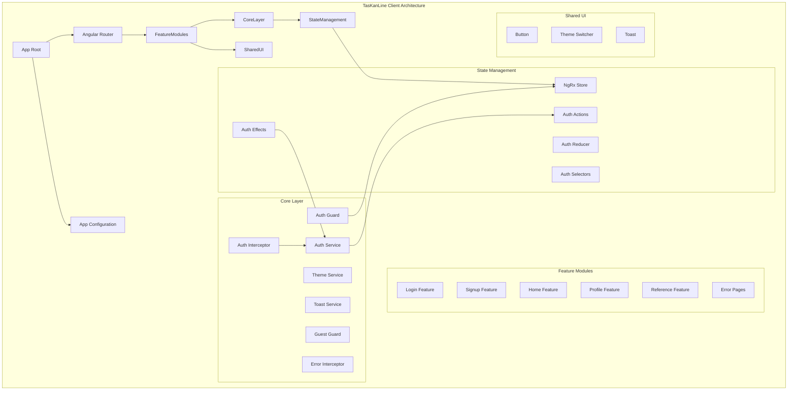
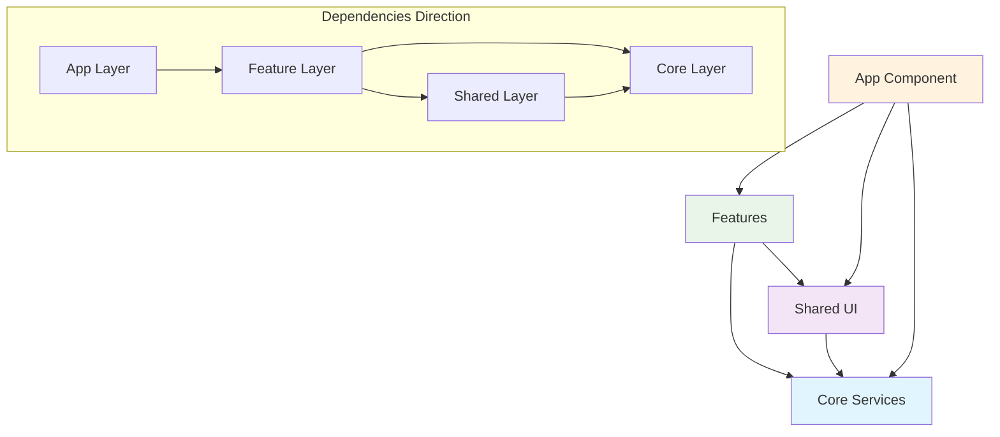
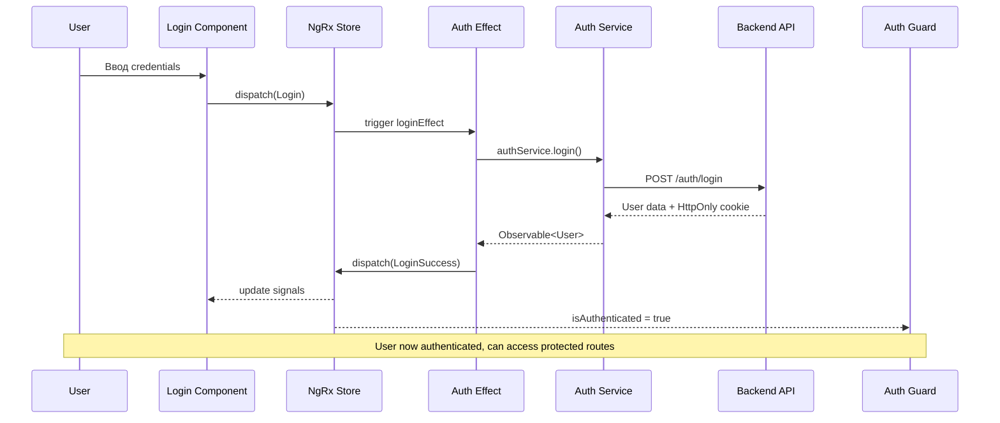
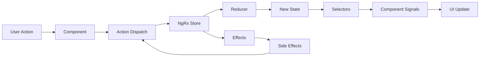
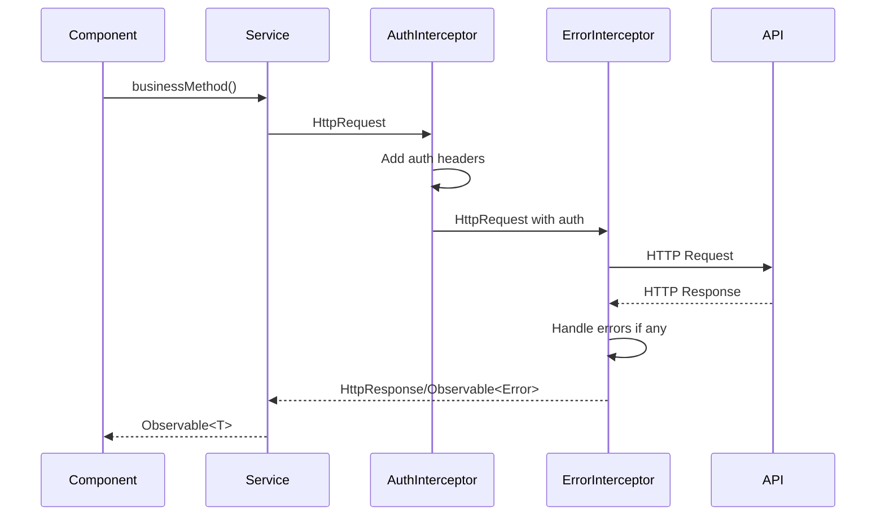

# 🏗️ Архитектура TasKanLine Client

Детальное описание архитектуры приложения, паттернов и архитектурных решений TasKanLine Client.

---

## 1️⃣ Обзор архитектуры

### 🎯 Архитектурная философия

TasKanLine Client построен на принципах современной frontend-разработки с акцентом на:

- **Предсказуемость** - четкая структура и правила
- **Масштабируемость** - возможность легко добавлять новые фичи
- **Поддерживаемость** - код, легко читаемый и модифицируемый
- **Производительность** - оптимизация рендеринга и использования ресурсов

### 🏛️ Ключевые архитектурные решения

#### Standalone Components Architecture

Мы используем Angular Standalone Components вместо NgModules:

- **Почему**: Упрощение dependency injection, снижение bundle size, улучшение tree-shaking
- **Преимущества**: Четкие границы компонентов, явные зависимости, лучшая инкапсуляция

#### Signals-based Reactive Programming

Angular Signals для локального состояния:

- **Почему**: Более производительное изменение detection, интуитивный синтаксис
- **Преимущества**: Automatic batching, оптимизированные перерисовки, меньше boilerplate

#### Feature-based Modular Structure

Организация по бизнес-фичам:

- **Почему**: Лучшая кохезия, изоляция логики, упрощенное навигирование
- **Преимущества**: Командная разработка по фичам, легкое рефакторинг

#### NgRx for Global State

Централизованное управление состоянием:

- **Почему**: Предсказуемые state updates, time-travel debugging, разделение concern'ов
- **Преимущества**: Single source of truth, чистые редьюсеры, typed actions

---

## 📊 High-Level Architecture Diagram



---

## 2️⃣ Детальная структура каталогов

### 📁 Корневая структура

```
src/app/
├── 📁 core/                    # Ядро приложения - глобальные сервисы
│   ├── auth/                   # Аутентификация и авторизация
│   │   ├── services/           # Auth сервисы
│   │   ├── guards/             # Route guards
│   │   ├── interceptors/        # HTTP interceptors
│   │   ├── models/             # Auth модели и DTO
│   │   └── store/              # NgRx auth slice
│   ├── services/               # Глобальные сервисы
│   │   ├── toast.service.ts    # Уведомления
│   │   └── theme-service.ts    # Управление темой
│   ├── models/                 # Глобальные модели
│   └── interceptors/           # Глобальные интерсепторы
├── 📁 features/                # Фичи - бизнес-логика
│   ├── login/                  
│   │   ├── login.ts
│   │   ├── login.html
│   │   ├── login.scss
│   │   └── login.spec.ts
│   ├── signup/                 # Регистрация
│   ├── home/                   # Главная страница
│   ├── profile/                # Профиль пользователя
│   ├── reference/              # Справочная система
│   └── errors/                 # Страницы ошибок
│       ├── not-found/
│       ├── forbidden/
│       └── server-error/
├── 📁 shared/                  # Переиспользуемые элементы
│   ├── ui/                     # UI компоненты
│   │   ├── button/             # Универсальная кнопка
│   │   ├── toast/              # Toast уведомления
│   │   └── theme-switcher/     # Переключатель темы
│   ├── pipes/                  # Custom pipes
│   ├── directives/             # Custom directives
│   └── utils/                  # Утилиты и helpers
├── 📁 layout/                  # Layout компоненты
├── app.ts                      # Root component
├── app.html                    # Root template
├── app.scss                    # Global styles
├── app.config.ts               # Angular DI configuration
├── app.routes.ts               # Routing configuration
└── index.ts                    # Barrel exports
```

### 🔄 Dependency Flow



---

## 3️⃣ Архитектурные паттерны

### 🧩 Smart/Presentational Components

#### Smart Components (Container Components)

```typescript
// Управляют состоянием, dispatch actions, subscribe to store
export class Login { 
  private store: Store,
  private fb: FormBuilder,
  // Store integration
  isLoading = this.store.selectSignal(selectIsLoading);
  error = this.store.selectSignal(selectError);

  // Form management
  loginForm = this.fb.group({
    /* ... */
  });

  // Business logic
  onSubmit(): void {
    this.store.dispatch(AuthActions.login({ request: formData }));
  }
}
```

#### Presentational Components (Dumb Components)

```typescript
// Только получают данные через inputs, эмитят события через outputs
export class Button { 
  // Input properties
  severity = input<ButtonSeverity>('primary');
  loading = input<boolean>(false);

  // Computed styles
  computedClasses = computed(() => /* ... */);

  // No service injection, no business logic
}
```

### 🔄 Service Layer Pattern

#### Core Services

```typescript
@Injectable({ providedIn: 'root' })
export class AuthService {
  private http = inject(HttpClient);

  // API communication
  login(data: LoginRequest): Observable<User> {
    return this.http.post<User>(`${this.authUrl}/login`, data);
  }

  // Cross-tab communication
  broadcastLogin(user: User): void {
    this.authChannel.postMessage({ type: 'login', payload: user });
  }
}
```

#### Feature Services (if needed)

```typescript
@Injectable({ providedIn: 'root' })
export class UserProfileService {
  private http = inject(HttpClient);

  getProfile(): Observable<UserProfile> {
    return this.http.get<UserProfile>('/api/user/profile');
  }
}
```

### 🎯 Component Communication Patterns

#### 1. Parent → Child (Input Binding)

```typescript
// Parent
<app-button [loading]="isLoading()" [disabled]="isDisabled()">

// Child
loading = input<boolean>(false);
```

#### 2. Child → Parent (Event Emission)

```typescript
// Child
@Output() buttonClick = new EventEmitter<void>();

onClick(): void {
  this.buttonClick.emit();
}

// Parent
<app-button (buttonClick)="handleClick()">
```

#### 3. Cross-Component (NgRx Store)

```typescript
// Component A - Dispatch
this.store.dispatch(AuthActions.login({ request }));

// Component B - Select
user = this.store.selectSignal(selectUser);
```

#### 4. Cross-Component (Service Signals)

```typescript
@Injectable({ providedIn: 'root' })
export class ThemeService {
  currentTheme = signal<Theme>('light');
}
```

---

## 4️⃣ 🔄 Data Flow Architecture

### 🔐 Authentication Flow



### 🔄 State Update Flow



### 🌐 HTTP Request Flow



---

## 5️⃣ 🛣️ Routing Architecture

### Route Structure

```typescript
export const routes: Routes = [
  // Public routes
  { path: '', component: Home },

  // Guest-only routes (not authenticated)
  {
    path: '',
    canActivateChild: [guestGuard],
    children: [
      { path: 'login', component: Login },
      { path: 'signup', component: Signup },
    ],
  },

  // Authenticated routes only
  {
    path: '',
    canActivateChild: [authGuard],
    children: [
      { path: 'profile', loadComponent: () => import('./features/profile/profile').then((m) => m.Profile) },
      { path: 'reference', loadComponent: () => import('./features/reference/reference').then((m) => m.Reference) },
    ],
  },

  // Error pages
  {
    path: 'error/403',
    loadComponent: () => import('./features/errors/forbidden/forbidden').then((m) => m.Forbidden),
  },
  {
    path: 'error/500',
    loadComponent: () => import('./features/errors/server-error/server-error').then((m) => m.ServerError),
  },

  // Catch-all
  { path: '**', loadComponent: () => import('./features/errors/not-found/not-found').then((m) => m.NotFound) },
];
```

### Guard Implementation

```typescript
export const authGuard: CanActivateChildFn = () => {
  const store = inject(Store);
  const router = inject(Router);

  return combineLatest([store.select(selectIsAuthenticated), store.select(selectIsLoading)]).pipe(
    filter(([_, isLoading]) => !isLoading), // Wait for auth check
    take(1),
    map(([isAuthenticated, _]) => {
      return isAuthenticated ? true : router.createUrlTree(['/login']);
    }),
  );
};
```

### Lazy Loading Strategy

Мы используем lazy loading для:

- **Feature модулей** - уменьшение initial bundle size
- **Error pages** - не загружаются при нормальной работе
- **Редко используемых компонентов** - оптимизация производительности

---

## 6️⃣ 🔄 State Management Architecture

### NgRx Store Structure

```typescript
interface AppState {
  [authFeatureKey]: AuthState;
  // Другие feature slices будут добавляться здесь
}

interface AuthState {
  user: User | null;
  isLoading: boolean;
  error: HttpErrorResponse | null;
  isAuthenticated: boolean;
}
```

### Action Organization

```typescript
export const AuthActions = createActionGroup({
  source: 'Auth',
  events: {
    // Login flow
    Login: props<{ request: LoginRequest }>(),
    'Login Success': props<{ user: User }>(),
    'Login Failure': props<{ error: HttpErrorResponse }>(),

    // Registration flow
    Signup: props<{ request: SignupRequest }>(),
    'Signup Success': props<{ response: SignupResponse }>(),
    'Signup Failure': props<{ error: HttpErrorResponse }>(),

    // Auth state management
    Logout: emptyProps(),
    'Check Auth': emptyProps(),
    'Check Auth Success': props<{ user: User }>(),
  },
});
```

### Selector Pattern

```typescript
// Base selectors
const selectAuthState = createFeatureSelector<AuthState>(authFeatureKey);

// Memoized selectors
export const selectUser = createSelector(selectAuthState, (state: AuthState) => state.user);

export const selectIsAuthenticated = createSelector(selectUser, (user: User | null) => !!user);

// Signal selectors for components
export const selectUserSignal = createSelector(selectUser, (user) => signal(user));
```

### Effects Pattern

```typescript
@Injectable()
export class AuthEffects {
  private actions$ = inject(Actions);
  private authService = inject(AuthService);

  login$ = createEffect(() =>
    this.actions$.pipe(
      ofType(AuthActions.login),
      exhaustMap(({ request }) =>
        this.authService.login(request).pipe(
          map((user) => AuthActions.loginSuccess({ user })),
          catchError((error) => of(AuthActions.loginFailure({ error }))),
        ),
      ),
    ),
  );
}
```

---

## 7️⃣ 🎨 Styling Architecture

### TailwindCSS Integration

```scss
// Основной файл стилей
@import 'tailwindcss/base';
@import 'tailwindcss/components';
@import 'tailwindcss/utilities';

// Custom CSS variables для темизации
:root {
  --color-primary: #3b82f6;
  --color-background: #ffffff;
  --color-text: #1f2937;
}

.dark {
  --color-primary: #60a5fa;
  --color-background: #1f2937;
  --color-text: #f9fafb;
}
```

### Component Styling Strategy

```typescript
@Component({
  // ...
  styleUrls: ['./login.scss'],
  changeDetection: ChangeDetectionStrategy.OnPush,
})
```

```scss
// login.scss - только component-specific стили
:host {
  display: block;
  max-width: 400px;
  margin: 0 auto;
}

// Стили, которые нельзя выразить через Tailwind
.form-container {
  // Специфичная логика positioning/overflow/etc
}
```

---

## 8️⃣ 🧪 Testing Architecture

### Unit Testing Strategy

```typescript
describe('Login', () => {
  let component: Login;
  let fixture: ComponentFixture<Login>;
  let store: MockStore;

  beforeEach(() => {
    TestBed.configureTestingModule({
      imports: [Login],
      providers: [
        provideMockStore({
          initialState: { auth: initialAuthState },
        }),
      ],
    });

    fixture = TestBed.createComponent(Login);
    component = fixture.componentInstance;
    store = TestBed.inject(Store) as MockStore;
    fixture.detectChanges();
  });

  it('should dispatch login action on form submit', () => {
    const spy = jest.spyOn(store, 'dispatch');

    component.loginForm.setValue({ email: 'test@test.com', password: 'password' });
    component.onSubmit();

    expect(spy).toHaveBeenCalledWith(
      AuthActions.login({
        request: { email: 'test@test.com', password: 'password' },
      }),
    );
  });
});
```

---

## 9️⃣ 🎨 Design System Details

### Color Palette

Используется **Flexoki color palette** с Teal accent:
```scss
:root {
  --flexoki-tx-1: #100f0f;
  --flexoki-bg-1: #fffcf0;
  --accent-teal: #0ea5e9;
}

.dark {
  --flexoki-tx-1: #cecdc3;
  --flexoki-bg-1: #100f0f;
}
```

### Typography

**IBM Plex** font family:
- **IBM Plex Sans** - для UI элементов
- **IBM Plex Serif** - для заголовков

---

## 🎯 Architectural Benefits

### 📈 Масштабируемость

- Feature isolation позволяет работать над разными частями параллельно
- NgRx обеспечивает предсказуемое управление состоянием
- Standalone components упрощают testing и рефакторинг

### 🚀 Производительность

- OnPush change detection + signals оптимизирует рендеринг
- Lazy loading уменьшает initial bundle size
- Memoized selectors предотвращают лишние вычисления

### 🔧 Поддерживаемость

- Четкая структура позволяет быстро находить нужный код
- Strong typing уменьшает runtime ошибки
- Comprehensive testing обеспечивает регрессионную безопасность

### 👑 Developer Experience

- Hot reloading и fast development cycle
- Time-travel debugging через NgRx DevTools
- IntelliSense и autocomplete благодаря TypeScript

---

## 📚 См. также

- [Components Guide](./components-guide.md) - Детальное описание компонентов
- [State Management](./state-management.md) - Глубокое погружение в NgRx
- [Diagrams](./diagrams.md) - Визуальные диаграммы архитектуры
- [Architectural Rules](./arch-rules.md) - Строгие правила и ограничения
