# 📊 Архитектурные диаграммы TasKanLine Client

Визуализация архитектуры, потоков данных и взаимодействий в TasKanLine Client. Все диаграммы используют Mermaid синтаксис для легкой интеграции с документацией.

---

## 📋 Оглавление

- [Общая архитектура](#-общая-архитектура)
- [Component Hierarchy](#-component-hierarchy)
- [Authentication Flow](#-authentication-flow)
- [State Management Flow](#-state-management-flow)
- [HTTP Request Flow](#-http-request-flow)
- [Navigation & Routing](#-navigation--routing)
- [Error Handling Flow](#-error-handling-flow)
- [Cross-tab Communication](#-cross-tab-communication)
- [Theme Management Flow](#-theme-management-flow)

---

## 🏗️ Общая архитектура

Высокоуровневая диаграмма всей системы с основными слоями и их взаимодействиями.

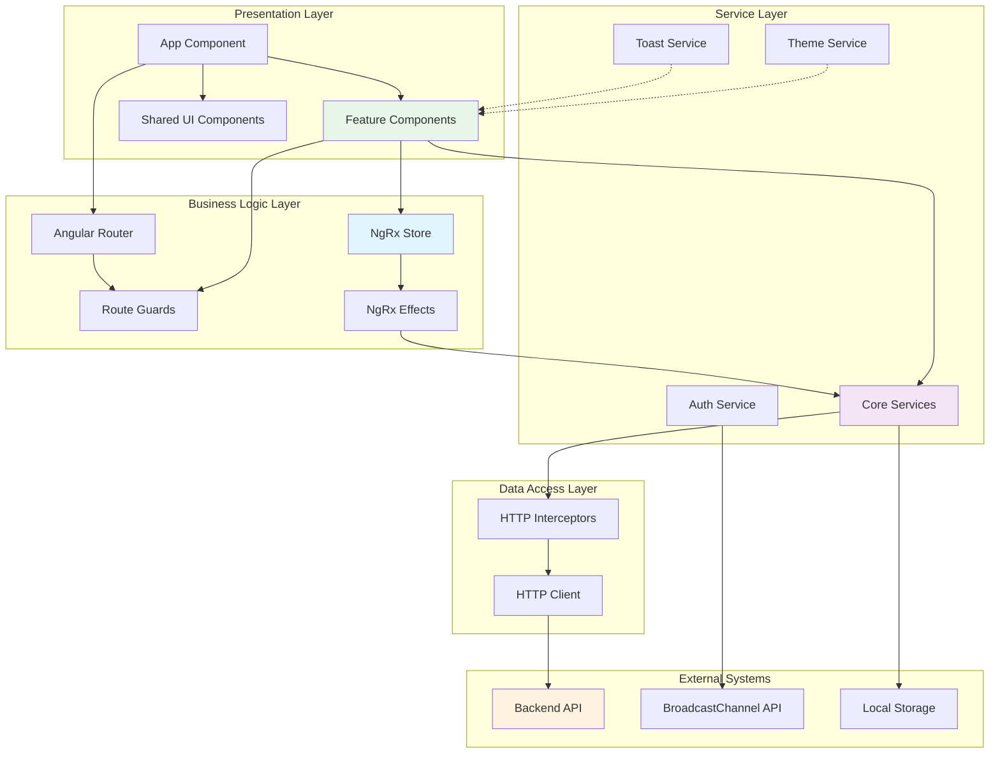

### 📦 Пакетная архитектура

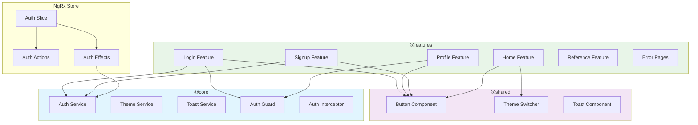

---

## 🧩 Component Hierarchy

Иерархия компонентов и их отношения наследования/композиции.

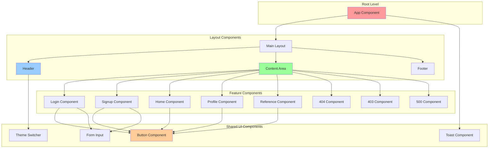

---

## 🔐 Authentication Flow

Полный поток аутентификации от пользователя до backend и обратно.

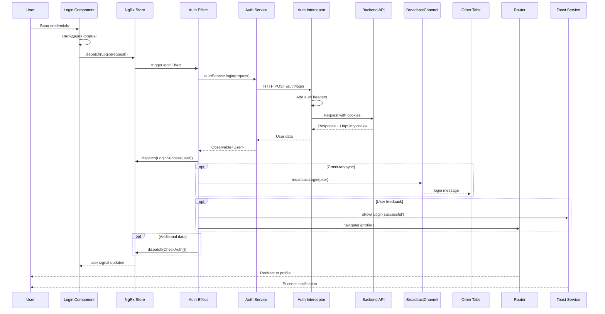

### Cross-tab Authentication Sync

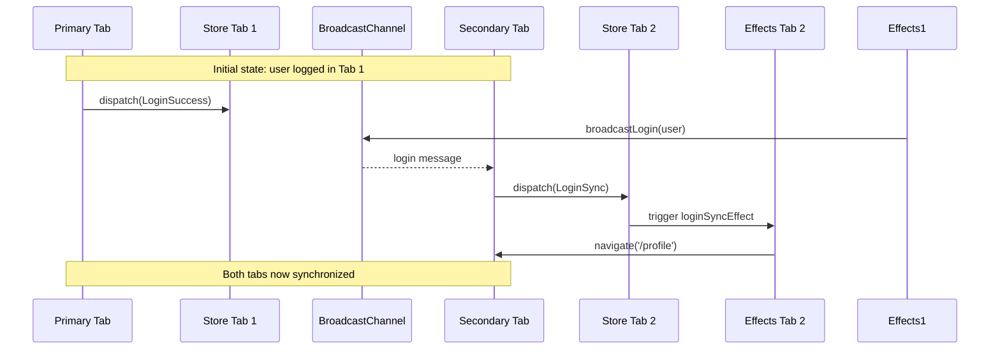

---

## 🔄 State Management Flow

Поток данных через NgRx Store и Signals в компонентах.

```mermaid
graph LR
    subgraph "UI Layer"
        UI[Component Template]
        Component[Component Class]
    end

    subgraph "NgRx Store"
        Actions[Actions]
        Reducer[Reducer]
        State[State]
        Selectors[Selectors]
        Effects[Effects]
    end

    subgraph "Services"
        AuthService[Auth Service]
        OtherServices[Other Services]
        ToastService[Toast Service]
        Router[Router]
    end

    subgraph "External"
        API[Backend API]
        Storage[Local Storage]
    end

    UI -.-> Component
    Component --> Actions
    Actions --> Effects
    Effects --> AuthService
    AuthService --> API
    API -->> AuthService
    AuthService --> Effects
    Effects --> Actions
    Actions --> Reducer
    Reducer --> State
    State --> Selectors
    Selectors --> Component
    Component --> UI

    Effects --> ToastService
    Effects --> Router
    Effects --> Storage

    style UI fill:#ffebcc
    style Actions fill:#ccf2ff
    style Effects fill:#ccffcc
    style API fill:#ffcccc
```

### State Update Timeline

```mermaid
gantt
    title NgRx State Update Timeline
    dateFormat X
    axisFormat %s

    section User Action
    Form Submit :0, 1

    section Store Actions
    Login Action :1, 2
    Login Effect :2, 4
    HTTP Request :4, 6
    Login Success :6, 7
    State Update :7, 8

    sideEffects :8, 10

    section UI Updates
    Loading State :1, 8
    Success State :8, 10
    Navigation :8, 9
    Toast Notification :8, 10
```

---

## 🌐 HTTP Request Flow

Полный цикл HTTP запроса через interceptors и обработку ответов.

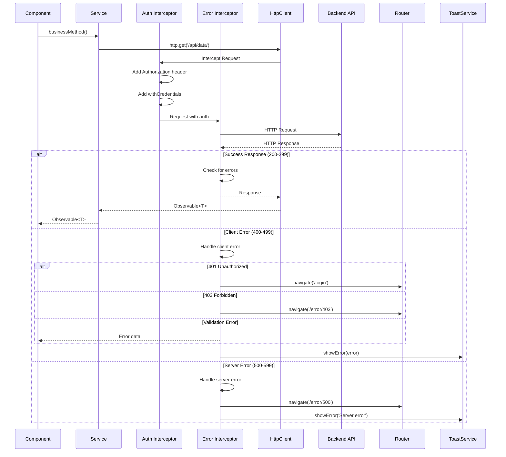

### Interceptor Chain

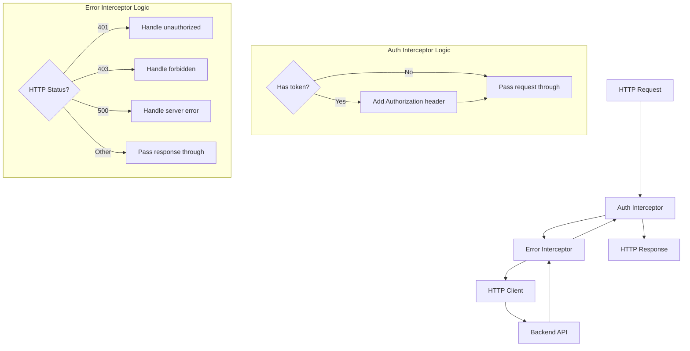

---

## 🔔 Toast Notifications Flow

Как работают уведомления от создания до отображения и удаления.

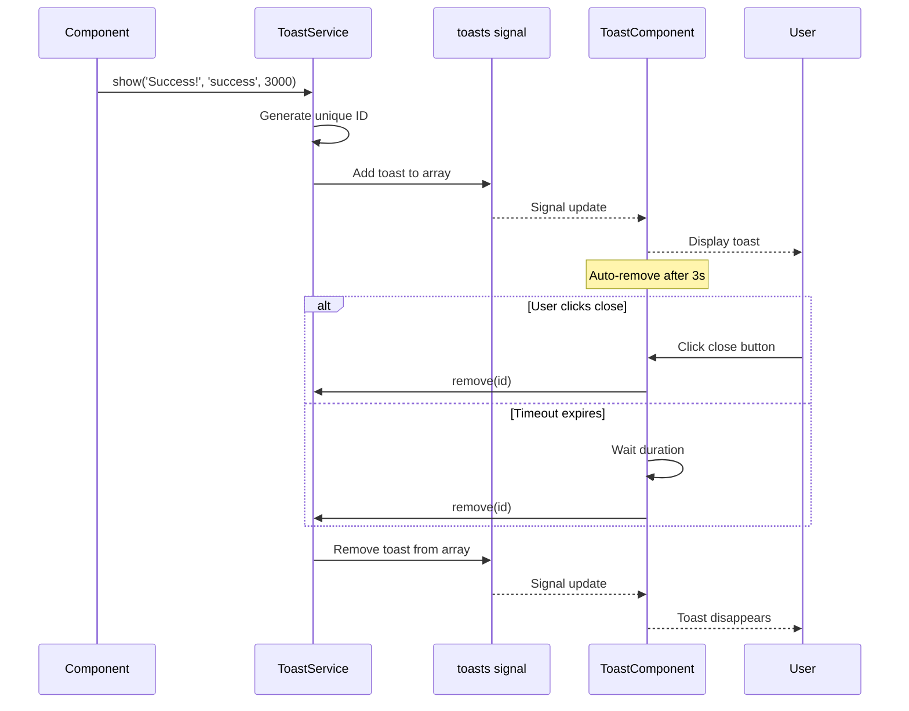

## 🎯 Signals Integration Pattern

Как Signals интегрируются с NgRx Store в компонентах.

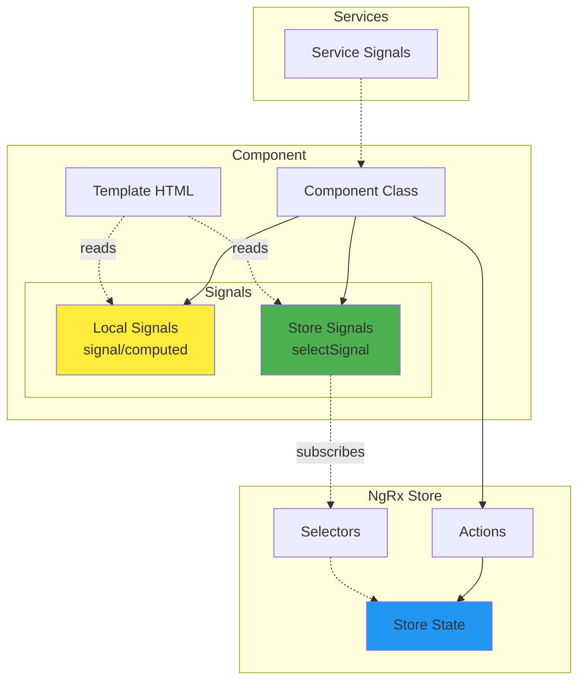

---

## 🛣️ Navigation & Routing

Маршрутизация приложения и защита роутов с помощью guards.

```mermaid
graph TD
    Start[/] --> CheckAuth{Check Auth}

    CheckAuth -->|Authenticated| Home[Home Page]
    CheckAuth -->|Not Authenticated| GuestHome[Public Home]

    GuestHome --> LoginPath[/login]
    GuestHome --> SignupPath[/signup]

    LoginPath --> GuestGuard{Guest Guard}
    GuestGuard -->|Guest| LoginComp[Login Component]
    GuestGuard -->|Authenticated| RedirectHome[Redirect to /]

    SignupPath --> GuestGuard
    GuestGuard -->|Guest| SignupComp[Signup Component]

    AuthenticatedRoutes[Authenticated Routes] --> AuthGuard{Auth Guard}
    AuthGuard -->|Authenticated| Profile[/profile]
    AuthGuard -->|Not Authenticated| RedirectLogin[Redirect to /login]

    Profile --> ProfileComp[Profile Component]

    ErrorRoutes[Error Routes] --> NotFound[** → 404]
    ErrorRoutes --> Forbidden[/error/403]
    ErrorRoutes --> ServerError[/error/500]

    NotFound --> NotFoundComp[404 Component]
    Forbidden --> ForbiddenComp[403 Component]
    ServerError --> ServerErrorComp[500 Component]

    style CheckAuth fill:#ffeb3b
    style GuestGuard fill:#4caf50
    style AuthGuard fill:#f44336
    style ErrorRoutes fill:#ff9800
```

### Guard Decision Flow

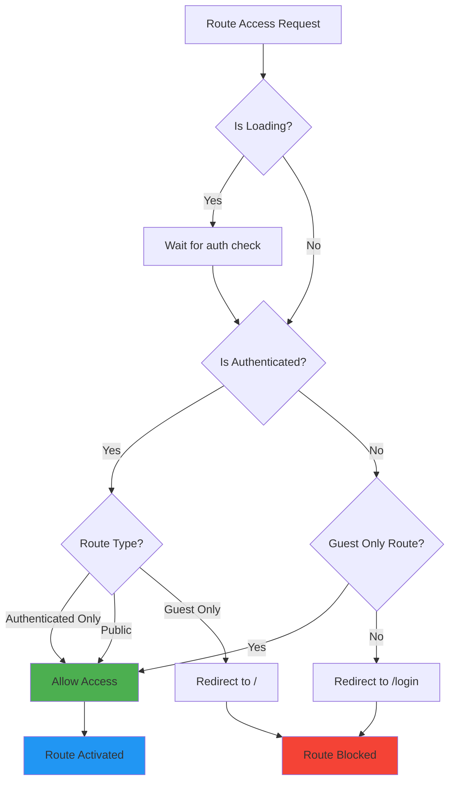

---

## ⚠️ Error Handling Flow

Обработка ошибок на разных уровнях приложения.

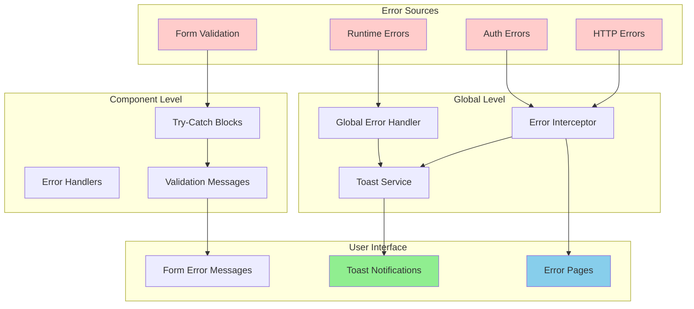

### Error Classification

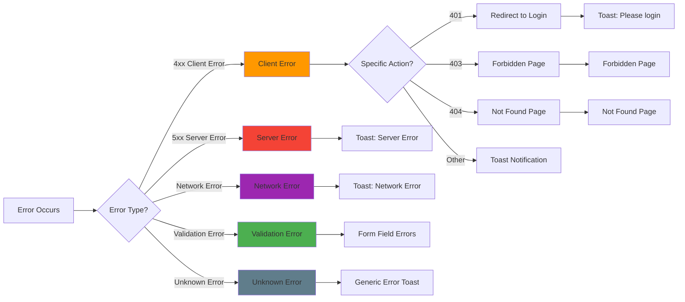

---

## 📡 Cross-tab Communication

Синхронизация состояния между вкладками браузера через BroadcastChannel.

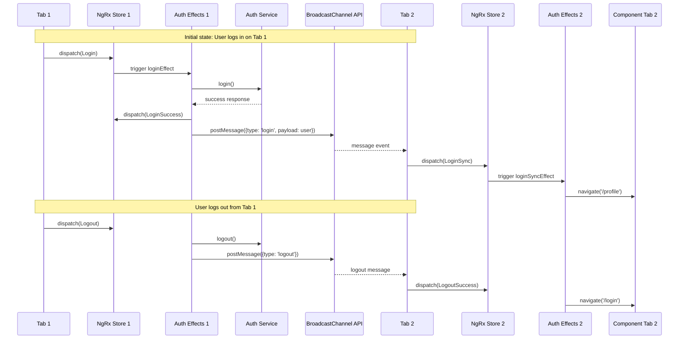

### BroadcastChannel Message Flow

```mermaid
stateDiagram-v2
    [*] --> Listening: Start listening

    Listening --> ReceivedMessage: Message received
    ReceivedMessage --> CheckType{Message type?}

    CheckType --> login: 'login'
    CheckType --> logout: 'logout'
    CheckType --> Listening: Unknown type

    login --> DispatchLoginSync: dispatch(LoginSync)
    DispatchLoginSync --> NavigateUser: Navigate to profile
    NavigateUser --> Listening

    logout --> DispatchLogout: dispatch(LogoutSuccess)
    DispatchLogout --> NavigateLogin: Navigate to login
    NavigateLogin --> Listening

    Listening --> Error: Error occurs
    Error --> Listening: Resume listening
```

---

## 🎨 Theme Management Flow

Управление темами приложения и синхронизация между вкладками.

```mermaid
graph TB
    subgraph "Theme Sources"
        SystemPreference[System Preference]
        SavedTheme[Saved Theme]
        UserAction[User Action]
    end

    subgraph "Theme Service"
        InitTheme[initTheme()]
        ToggleTheme[toggleTheme()]
        ApplyTheme[applyTheme()]
        ThemeSignal[currentTheme signal]
    end

    subgraph "Theme Application"
        CSSClasses[CSS Classes]
        DOMAttribute[HTML Attribute]
        ComponentReactions[Component Reactions]
    end

    subgraph "Storage"
        LocalStorage[Local Storage]
        SystemMediaQuery[Prefers-color-scheme]
    end

    SystemPreference --> InitTheme
    SavedTheme --> InitTheme
    UserAction --> ToggleTheme

    InitTheme --> ThemeSignal
    ToggleTheme --> ThemeSignal
    ThemeSignal --> ApplyTheme

    ApplyTheme --> LocalStorage
    ApplyTheme --> CSSClasses
    ApplyTheme --> DOMAttribute

    CSSClasses --> ComponentReactions
    DOMAttribute --> ComponentReactions

    ComponentReactions --> UIUpdate[UI Updates]

    style ThemeSignal fill:#ffeb3b
    style ComponentReactions fill:#4caf50
    style UIUpdate fill:#2196f3
```

### Theme State Machine

```mermaid
stateDiagram-v2
    [*] --> Init: Service created

    Init --> CheckSystem{System prefers dark?}
    CheckSystem -->|Yes| Dark: Set dark theme
    CheckSystem -->|No| Light: Set light theme

    Light --> UserToggle: User clicks toggle
    Dark --> UserToggle: User clicks toggle

    UserToggle --> Light: Switch to light
    UserToggle --> Dark: Switch to dark

    Light --> ApplyLight: Apply light theme
    Dark --> ApplyDark: Apply dark theme

    ApplyLight --> SaveLight: Save to localStorage
    ApplyDark --> SaveDark: Save to localStorage

    SaveLight --> Light: Stable state
    SaveDark --> Dark: Stable state
```

---

## 🎯 Usage Instructions

### Включение диаграмм в документацию

````markdown
```mermaid
<!-- Код диаграммы -->
```
````

```

### Советы по созданию новых диаграмм

1. **Используйте последовательные диаграммы** для flow процессов
2. **Используйте graph диаграммы** для архитектурных представлений
3. **Используйте state diagrams** для состояний и переходов
4. **Используйте gantt charts** для временных линий
5. **Сохраняйте читаемость** - не перегружайте деталями
6. **Используйте цвета** для визуального разделения слоев
7. **Добавляйте комментарии** для сложных переходов

### Обновление диаграмм

При изменении архитектуры:
1. Обновите соответствующие диаграммы
2. Проверьте, что все связи актуальны
3. Убедитесь, что цвета соответствуют соглашениям
4. Обновите этот документ при добавлении новых диаграмм

---

## 📚 Связанная документация

- [Architecture Overview](./architecture.md) - Детальное описание архитектуры
- [State Management](./state-management.md) - NgRx и Signals детали
- [Components Guide](./components-guide.md) - Компонентная архитектура
- [Authentication Flow](../usage.md#-аутентификация) - Практическое использование

---

**💡 Совет:** Эти диаграммы - живой документ. Они должны обновляться вместе с изменениями в архитектуре приложения! 🔄
```
